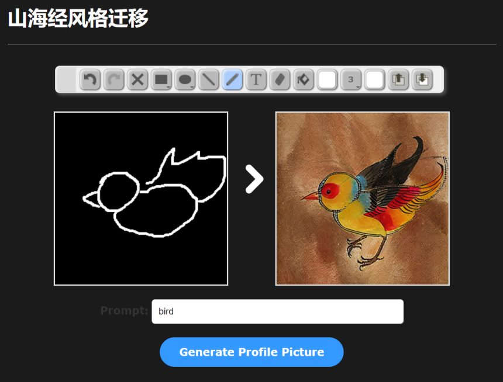

# Design of a Style Transfer and Generation Framework for the Tangut-Language Classic of Mountains and Seas


## 项目特性

- **AI驱动的风格迁移**：利用人工智能技术，将西夏文《山海经》的艺术风格转化到现代图像生成任务中。

- **文本与简笔画输入**：用户可以输入文本描述或简笔画，系统生成与输入内容匹配的风格化图像。

- **跨平台兼容性**：支持手机、平板和桌面电脑等多平台访问，确保系统可跨设备使用。

- **实时交互**：支持用户实时调整风格强度和细节保留程度，满足不同场景下的创作需求。

## 文件结构

  ```
  Shan-Hai-Jing-Style-Transfer/
  │
  ├── app.py                    # Flask 后端应用
  ├── pipe_utils.py             # 辅助函数，包括图像增强和管道创建
  ├── models/                   # 控制模型文件
  ├── static/                   # 静态文件目录，保存生成的图像
  │   └── cache/                # 临时缓存文件
  ├── templates/                # 前端模板（HTML文件）
  │   └── index.html            # 前端主页
  └── requirements.txt          # Python依赖包列表
  ```

## 安装

### 环境要求

- **Python 3.10**及以上版本
- **Flask**：用于后端开发
- **Stable Diffusion v1.5模型**（用于图像生成）
- **ControlNet**、**LoRA**：用于增强和风格迁移
- **HTML5/JavaScript**：用于前端开发，确保多平台支持

### 设置

1. 克隆该仓库：

   ```
   git clone https://github.com/your-repository.git
   cd Shan-Hai-Jing-Style-Transfer
   ```

2. 安装所需的Python依赖：

   ```
   pip install -r requirements.txt
   ```

3. 设置后端：

   - 安装Flask：

     ```
     pip install Flask
     ```

   - 启动Flask服务器：

     ```
     python app.py
     ```

4. 打开前端界面（在浏览器中访问 `localhost:5000`）。

## 使用方法

### 前端交互

- **图像上传**：上传您的图像或简笔画，系统将其转化为具有《山海经》风格的艺术作品。
- **文本输入**：输入文本描述您的目标图像。例如，“一只神话生物，背景是山脉”，系统会生成相应的图像。
- **风格定制**：使用风格强度和结构保留的调整滑块，灵活控制风格的应用和细节保留。

### 图像生成流程

1. 用户通过前端上传图像或输入文本描述。
2. 后端接收到请求后，调用 `generate_image` 路由处理生成图像。
3. 使用 ControlNet 和 Stable Diffusion 模型生成风格化图像。
4. 生成的图像通过Base64编码返回前端，并在页面展示。



## 评估

生成的艺术作品通过自动化和主观评估两种方式进行评价：

- **自动化指标**：使用FID（Fréchet Inception Distance）和SSIM（结构相似性指数）来评估生成图像的质量。
- **主观评价**：通过用户反馈评估风格一致性、结构还原度、色彩协调性和创意表达力。

## 未来工作

- 改进模型在复杂场景和细节生成方面的表现。
- 扩展系统支持更多传统文化风格的应用，推动传统艺术的数字化转化。

## 联系方式

如需进一步的信息请联系qq1006775897@163.com或提交issue。